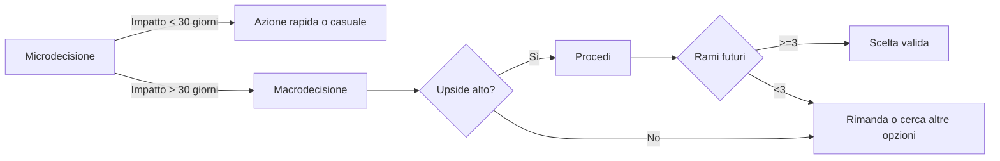

# Bussola decisionale personale

> [!TIP] 
Principio guida
> Non scegliere ciò che sembra migliore oggi.  
> Scegli ciò che ti permette di scegliere meglio domani.

---

## 1) Separare micro e macro

- **Microdecisione**: non cambia il mio set di opzioni tra 30 giorni.
- **Macrodecisione**: cambia il mio set di opzioni tra 30 giorni.

> [!WARNING] 
L’optionalità si applica alle **macro**. Le **micro** vanno automatizzate.

---

## 2) Protocollo microdecisioni (10 secondi)

1. Tra 30 giorni importerà? → **No**
2. Scegli la **prima opzione accettabile** / regola fissa / a caso
3. **Chiudi il fascicolo mentale**

> [!IMPORTANT] 
Formula anti-rimpianto:  
> "Questa decisione non era degna di rimpianto."

---

## 3) Bussola per le macrodecisioni

### Passo 0 – Allerta
> Se non vedo le conseguenze a 6–12 mesi, **rimando**.

### Passo 1 – Upside
- Basso / Medio / **Alto**

### Passo 2 – Reversibilità
> Perdo in modo definitivo **tempo, reputazione, capitale**?  
> (più di uno = rischio)

### Passo 3 – Rami futuri
> Elenco **almeno 3 sviluppi possibili** che si aprono **solo** se scelgo questa opzione.

### Passo 4 – Porte chiuse
> Quali alternative buone sto chiudendo **troppo presto**?

> [!TIP] 
Regola finale:  
> A parità di costo iniziale, scegli l’opzione che mantiene più opzioni future.

---

## 4) Budget di rimpianto

- **0 rimpianti** per decisioni sotto i 15 minuti di impatto
- **1 rimpianto serio** al mese (massimo)

---

## 5) Promemoria

- L’optionalità è una strategia **di livello superiore**
- Applicarla ovunque produce **paralisi**
- Molte scelte **non meritano memoria**